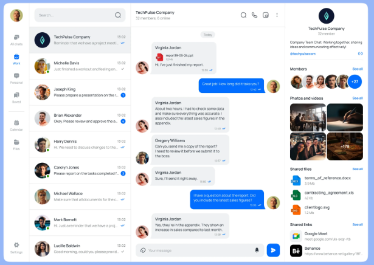

# Feature: Modern Chat Application UI (Telegram/Slack Style)

<!--
  ╔══════════════════════════════════════════════════════════════════╗
  ║  THIS FILE IS THE GOAL YOU HAND TO THE AUTONOMOUS LOOP.         ║
  ║  Fill in every section below, drop your screenshot as          ║
  ║  reference.png (project root), then start the loop (see README)║
  ╚══════════════════════════════════════════════════════════════════╝
-->

## What to build

Build a modern chat application UI that closely matches the provided reference design.

The application should contain a left navigation sidebar, chat list panel, conversation panel, and user/profile details panel. Use dummy data only. All application state (users, chats, selected conversation, messages, unread counts, typing state, etc.) must be managed through a centralized global state store and persist during the current browser session.

---

## Reference UI

<!-- Save your screenshot at the project root as reference.png. -->

---

## Functional requirements

### Layout

- [ ] The application uses a 4-column desktop layout:
  - Navigation Sidebar
  - Chat List Panel
  - Conversation Panel
  - Details/Profile Panel

- [ ] Layout fills the full browser viewport height.

- [ ] Layout remains visually consistent across common desktop widths (1280px+).

- [ ] All panels have proper spacing, borders, shadows, and rounded corners matching the reference design.

---

### Navigation Sidebar

- [ ] Left navigation sidebar contains:
  - User avatar section
  - All Chats
  - Work
  - Personal
  - Saved
  - Calendar
  - Files
  - Settings

- [ ] Navigation items display icons and labels.

- [ ] Active navigation item is visually highlighted.

- [ ] Clicking a navigation item updates the selected section in global state.

---

### Chat List Panel

- [ ] Chat list displays at least 15 dummy conversations.

- [ ] Each conversation item contains:
  - Avatar
  - User/Group name
  - Last message preview
  - Timestamp
  - Unread badge (when applicable)

- [ ] Active conversation is visually highlighted.

- [ ] Clicking a conversation selects it and updates global state.

- [ ] Search input is displayed at the top of the chat list.

- [ ] Search filters conversations in real-time.

---

### Conversation Panel

- [ ] Conversation header contains:
  - Avatar
  - User/Group name
  - Online/member status
  - Action icons (search, call, video, menu)

- [ ] Messages are loaded from global state.

- [ ] Incoming messages appear on the left.

- [ ] Outgoing messages appear on the right.

- [ ] Message bubbles match modern messaging UI patterns.

- [ ] Messages display timestamp.

- [ ] Date separators appear between message groups when configured in dummy data.

- [ ] Conversation panel supports vertical scrolling.

---

### Message Composer

- [ ] Composer is fixed at the bottom of the conversation panel.

- [ ] Composer contains:
  - Text input
  - Attachment button
  - Emoji button
  - Send button

- [ ] Sending a message:
  - Adds the message to the current conversation
  - Updates last message preview
  - Updates conversation timestamp
  - Stores data in global state

- [ ] Empty messages cannot be sent.

- [ ] Sent messages appear instantly in the conversation view.

---

### Details/Profile Panel

- [ ] Profile panel displays:
  - Large avatar
  - User/Group name
  - Description/About section
  - Member list
  - Photos section
  - Shared files section
  - Shared links section

- [ ] Data is populated from dummy data stored in global state.

- [ ] Sections visually resemble the reference layout.

---

### Global State Management

- [ ] All chat data is managed through a centralized global state store.

- [ ] Store contains:
  - Users
  - Conversations
  - Messages
  - Selected conversation
  - Selected navigation tab
  - Search query
  - Unread counts

- [ ] No conversation state is managed locally inside UI components.

- [ ] Components read and update data exclusively through the global store.

- [ ] State updates trigger immediate UI refresh.

---

### Dummy Data

- [ ] Application loads realistic dummy data on startup.

- [ ] Dummy data includes:
  - Users
  - Group chats
  - Messages
  - Online status
  - Shared files
  - Shared links
  - Media items

- [ ] Data structure is organized and scalable for future API integration.

---

### Reusability

- [ ] Create reusable UI components for:
  - Sidebar Navigation
  - Chat List Item
  - Conversation Header
  - Message Bubble
  - Message Composer
  - Profile Card
  - Member Avatar List
  - Shared File Item
  - Shared Link Item

- [ ] Components are modular and maintainable.

---

## Animation / Interaction (optional)

- [ ] Navigation items animate on hover (150–200ms).

- [ ] Chat list items have subtle hover feedback.

- [ ] Active conversation transitions smoothly.

- [ ] Send button has hover and click states.

- [ ] Message bubbles animate into view when new messages are sent.

- [ ] Profile panel sections use smooth expand/collapse animations where applicable.

---

## Technical Requirements

- [ ] Use existing design system/UI components where available.

- [ ] If a required component does not exist, create a reusable custom component.

- [ ] Follow modern React architecture and best practices.

- [ ] Use TypeScript throughout the feature.

- [ ] Avoid hardcoded UI duplication.

- [ ] Keep styling clean, scalable, and production-ready.

- [ ] Ensure responsive behavior for tablet and desktop layouts.

---

## Done when

- [ ] Every functional requirement above works in the running app (Playwright green)

- [ ] The live UI visually matches reference.png — layout, spacing, colors, hierarchy, typography, and interactions

- [ ] Chat navigation works correctly

- [ ] Conversation switching works correctly

- [ ] Message sending works correctly

- [ ] All data flows through the global state store

- [ ] No console errors or warnings

- [ ] UI is polished, modern, and production-quality

- [ ] UI is fully responsive in all devices, it should be completely progressive UI